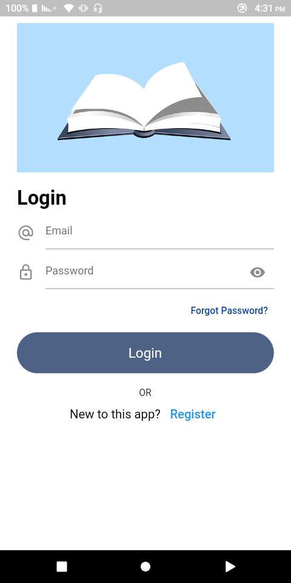
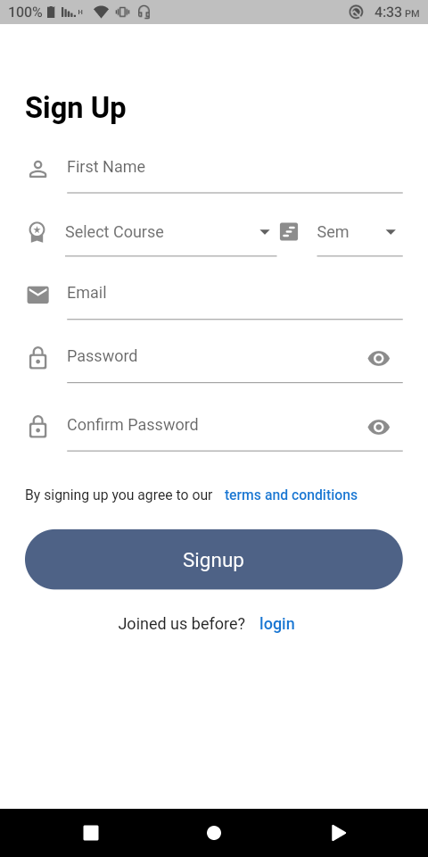
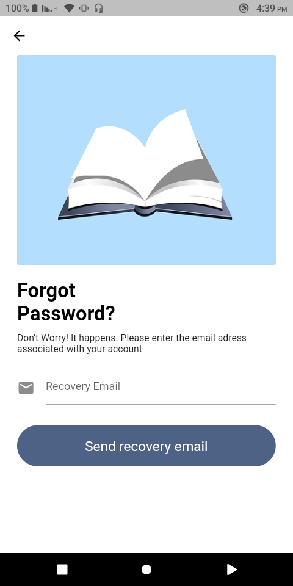
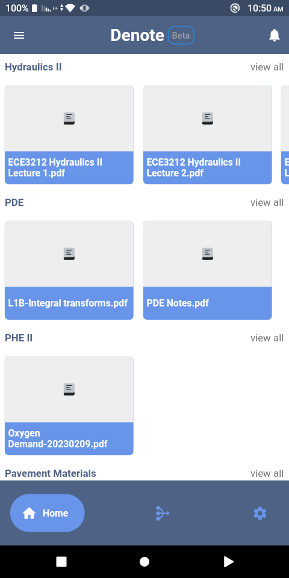
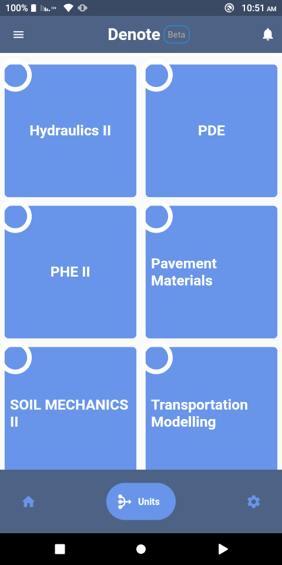
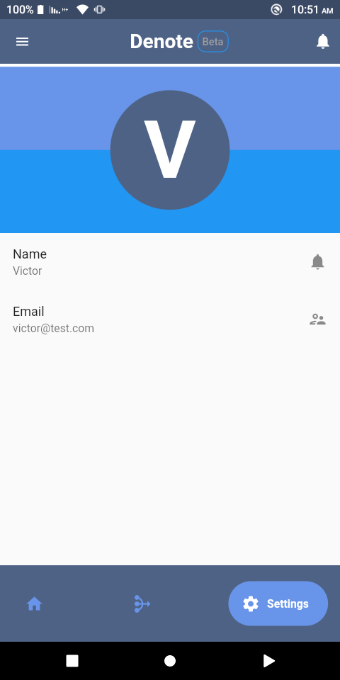

# Denote

An Open source documents-sharing app using firebase and flutter.

## Introduction

Denote is an open source application built for my classmates to easily manage and access class notes.
The core objectives are:

* To have all notes related to a specific unit together.
* Authenticated uses can access the notes any time they need.
* Save on space taken by the notes when stored locally.
* Students can access notes of previous semesters.

## Stack

* Flutter UI
* Firebase

# Main Features

## Firebase Auth

Email-Password Authentication is done by the firebase_auth package

## Firebase Firestore

User data is stored in firebase cloud firestore which is used to retrieve the notes as per their selected course

## Firebase Storage

All the notes are stored in firebase storage in the _course/semester/unit_ order

## Homepage

These are the homepage views:

## PDF Viewer

