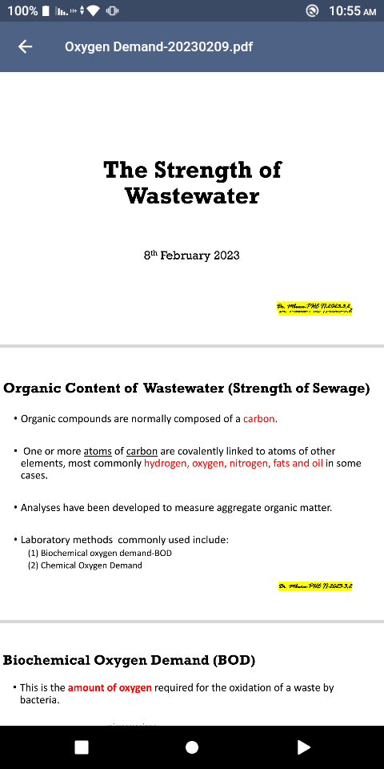

# Denote

An Open source documents-sharing app using firebase and flutter.

## Introduction

Denote is an open source application built for my classmates to easily manage and access class notes.
The core objectives are:

* To have all notes related to a specific unit together.
* Authenticated uses can access the notes any time they need.
* Save on space taken by the notes when stored locally.
* Students can access notes of previous semesters.

## Stack

* Flutter
* Firebase

# Main Features

## Firebase Auth

Email-Password Authentication is done by the firebase_auth package

<div align="center">


</div>


## Firebase Firestore

User data is stored in firebase cloud firestore which is used to retrieve the notes as per their selected course

## Firebase Storage

All the notes are stored in firebase storage in the _course/semester/unit_ order

## Homepage

These are the homepage views:


<div align="center">


</div>


## PDF Viewer
<div align="center">

</div>

## packages used
```dart
google_nav_bar: ^5.0.6
  firebase_core: ^2.4.1
  firebase_auth: ^4.2.5
  cloud_firestore: ^4.3.1
  firebase_storage: ^11.0.10
  firebase_app_check: ^0.1.1+8
  file_picker:
  path_provider: ^2.0.12
  dio: ^4.0.6
  open_filex:
  flutter_svg: ^2.0.1
  syncfusion_flutter_pdfviewer: ^20.4.51
  ```

